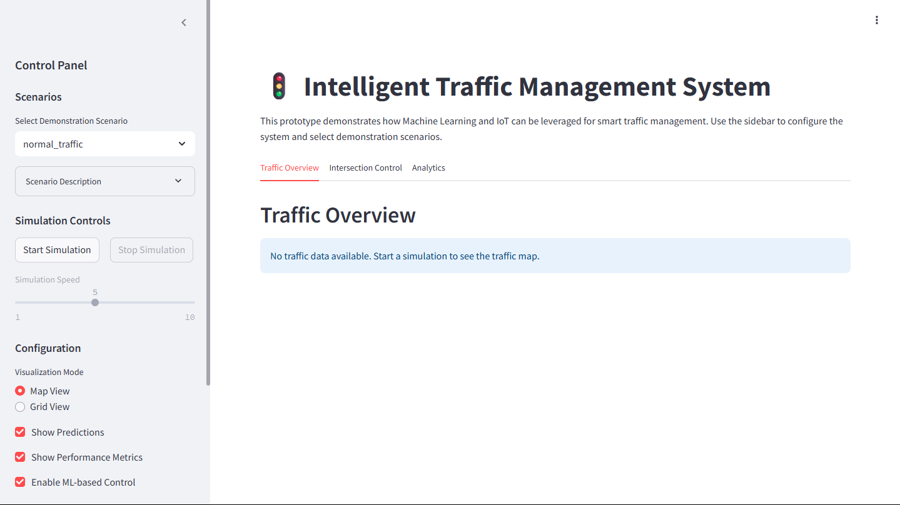

# Intelligent Traffic Management System

## Overview
This prototype demonstrates a smart traffic management system that leverages Machine Learning and simulated IoT data to optimize traffic flow, reduce congestion, and enhance road safety. The application showcases how intelligent systems can dynamically adjust traffic signals based on real-time conditions and predictions.



## Features

### Traffic Simulation
- Real-time traffic data simulation for multiple intersection scenarios
- Support for various traffic conditions (normal, rush hour, incidents)
- Emergency vehicle detection and prioritization
- Configurable parameters for traffic density, speed, and congestion levels

### Machine Learning Integration
- Traffic congestion prediction based on current patterns
- Wait time forecasting for different intersections and lanes
- Adaptive learning capabilities that improve over time
- Model metrics visualization for transparency

### Adaptive Signal Control
- Dynamic signal timing adjustments based on ML predictions
- Emergency vehicle prioritization logic
- Traditional vs. ML-based control performance comparison
- Manual override capabilities for testing scenarios

### Visualization Dashboard
- Interactive map view of traffic conditions across multiple intersections
- Detailed grid view for individual intersection analysis
- Real-time performance metrics display
- Comparative analytics between traditional and ML-based approaches

## Demonstration Scenarios

1. **Normal Traffic Conditions** - Baseline traffic flow with balanced vehicle distribution
2. **Rush Hour Congestion** - Heavy traffic simulating morning/evening peak hours
3. **Emergency Vehicle Priority** - Demonstrates emergency vehicle detection and signal prioritization
4. **Unbalanced Traffic Flow** - Traffic concentrated in certain directions
5. **Traffic Incident Response** - Simulates a traffic incident causing congestion

## Technical Implementation
The system consists of several integrated modules:

- **Traffic Simulator** (`data_simulation.py`) - Generates realistic traffic patterns
- **ML Predictor** (`ml_prediction.py`) - Implements traffic prediction models
- **Signal Controller** (`signal_control.py`) - Controls traffic signals using both traditional and ML-enhanced methods
- **Visualization Engine** (`visualization.py`) - Renders interactive traffic visualizations
- **Scenario Manager** (`scenarios.py`) - Manages predefined demonstration scenarios
- **Database Interface** (`database.py`) - Handles data storage and retrieval
- **Utility Functions** (`utils.py`) - Provides supporting calculations and metrics

## Getting Started

### Prerequisites
- Python 3.11 or newer
- Required libraries: streamlit, scikit-learn, pandas, numpy, plotly

### Installation
1. Clone this repository
2. Install required packages:
   ```
   pip install streamlit scikit-learn pandas numpy plotly
   ```
3. Run the application:
   ```
   streamlit run app.py
   ```

### Using the Application
1. Select a demonstration scenario from the sidebar
2. Click "Start Simulation" to begin the traffic simulation
3. Explore the different views in the tabs:
   - Traffic Overview - Map visualization of the entire system
   - Intersection Control - Detailed view of individual intersections
   - Analytics - Performance metrics and ML predictions

4. Experiment with different settings:
   - Toggle between Map and Grid views
   - Enable/disable ML-based control
   - Adjust simulation speed
   - Try manual emergency vehicle triggers

## Performance Metrics
The system evaluates performance using several key metrics:
- Average wait time per vehicle
- Throughput (vehicles per minute)
- Congestion level percentage
- Emergency response time
- ML prediction accuracy

## Future Enhancements
- Integration with real IoT sensor data
- More sophisticated ML models (deep learning, reinforcement learning)
- Real-time video processing for vehicle detection
- Mobile application for traffic authorities
- API for third-party integration

## Project Context
This project was developed as a prototype for a Bachelor of Science in Information Technology degree project at Karatina University. It serves as a proof-of-concept for intelligent traffic management systems that could help reduce congestion and improve traffic flow in urban areas.

## License
This project is available for educational and research purposes.

---

*Developed by [Geoffrey Nthuli]*